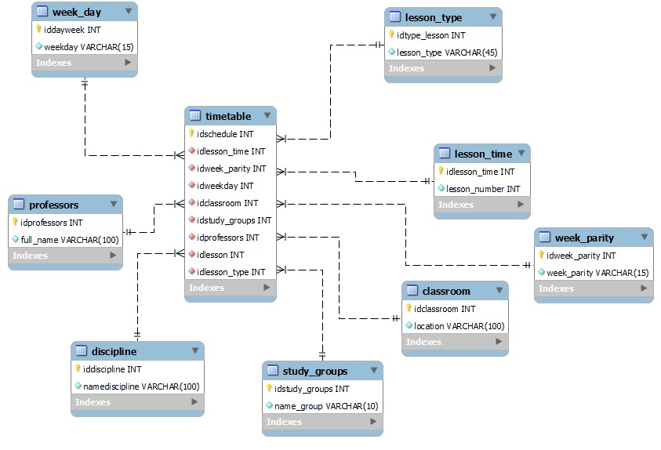

# "Клинент-серверное приложение"

## <a id ="tok">Оглавление</a>
---
[:one:Описание проекта](#tok1) 
[:two:Технологии](#tok2) 
[:three:MVP](#tok3)   
[:four:Модель базы данных](#tok4) 
[:five:Документация классов/методов](#tok5) 
[:six:Доп. ссылки](#tok6) 
---

<a id ="tok1"> Описание проекта  </a>
---

>Предметной областью проекта является работа с расписанием вуза.
Под работой имеется ввиду взаимодействие клиента с сервером. Клиент обращается к серверу путем hhtp запроса, сервер обрабатывает запрос и посылает ответ в виде (*****).  Сервер получает информацию из базы данных путем параметризированных запросов.

[:arrow_up:Оглавление](#tok)
---
<a id ="tok2"> Технологии  </a>
---
Вид технологии | Название | Версия
:----|:------:|-----:
Язык программирования | C\#| .NET 5.0
СУБД|MySQL|8.0
Протокол передачи данных |http|(++++)
Хостинг |AWS| бесплатная 

[:arrow_up:Оглавление](#tok)
---

<a id ="tok3"> MVP  </a>
---

1. Создание первоначального макета базы данных. Создание примитивного сервера, способного поучить информацию из базы данных с помощью параметризированных SQL запросов.
2. Определение протокола передачи данных, создание примитивного клиента. Реализация способности сервера ответить на примитивный запрос. Ревю базы данных, доработка модели. Создание запросов под новую модель. 
3. Расширение списка запросов и ответов у клиента и сервера. Увеличение количества параметризированных запросов в соответствии с нуждами для ответа клиенту. Развёртывание на сервере. Заполнение базы данных. 
4. Финальное исправление багов. Привидение консольного вывода клиента в "легко" воспринимаемый формат. Оптимизация SQL запросов.
* P.S. В данном MVP ведение документации, создание unit-тестов будет производиться по мере надобности, поэтому во избежание дублирования эти аспекты не прописаны.

[:arrow_up:Оглавление](#tok)
---
<a id ="tok4"> Модель базы данных  </a>
---

[:arrow_up:Оглавление](#tok)
---

<a id ="tok5"> Документация классов/методов </a>
---

[Wiki](https://github.com/Sekfiser/Client-Server-Project/wiki/Документация-классов-методов)

[:arrow_up:Оглавление](#tok)
---
<a id ="tok6"> Ссылки </a>
---
[JIRA](https://client-server-project.atlassian.net/jira)

[:arrow_up:Оглавление](#tok)
---
